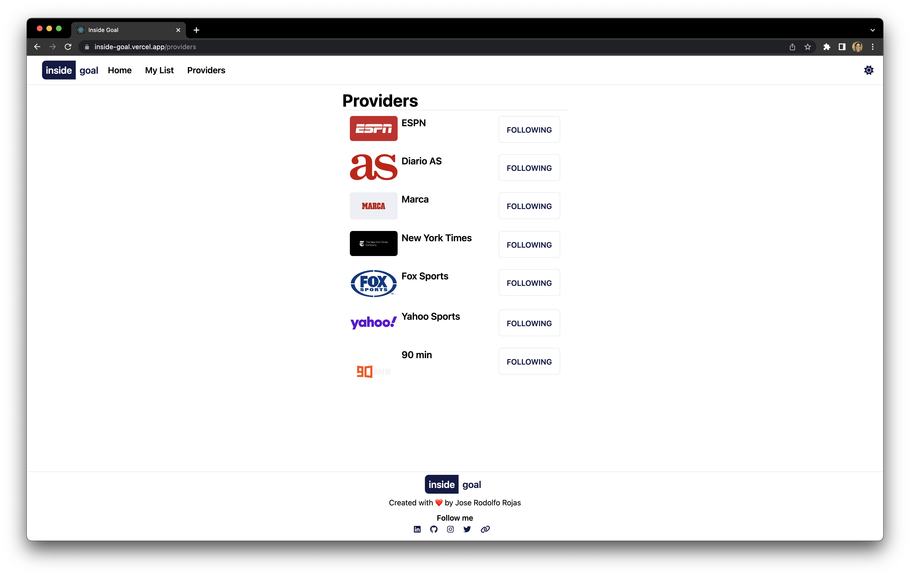

# Inside Goal
A RSS feed about international soccer notices.
## Demo
[Live Demo Inside Goal](https://inside-goal.vercel.app)

[Inside Goal Backend](https://github.com/jrodolforojas/inside-goal-backend)

## Screenshots

## Technologies

## How to run?
In the project directory, you can run:

`npm install`

Install all project dependencies

`npm start`

Runs the app in the development mode. Open [http://localhost:3000]() to view it in your browser.
The page will reload when you make changes. You may also see any lint errors in the console.

## Instructions

Are you able to build the best RSS reader?
Create a news aggregator focused on a single industry.

Let's start at the beginning, what is RSS?
RSS stands for Really Simple Syndication, and it is used to distribute information associated with web content in XML
format.

Let's think about the world of software development; so much news appear every day that we don't know how to consume
such amount of information. Sometimes even where to start looking.

The goal of this Challenge is to create the best news aggregator app in RSS format.

> This is a challenge created by [MoureDev](https://www.twitch.tv/mouredev). He will review and give feedback to some
> proposed solutions from the community in one of his Twitch livestreams 😻
